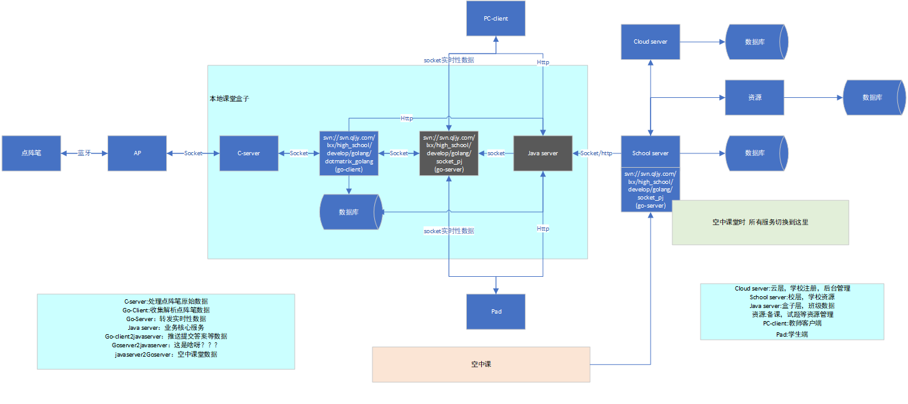
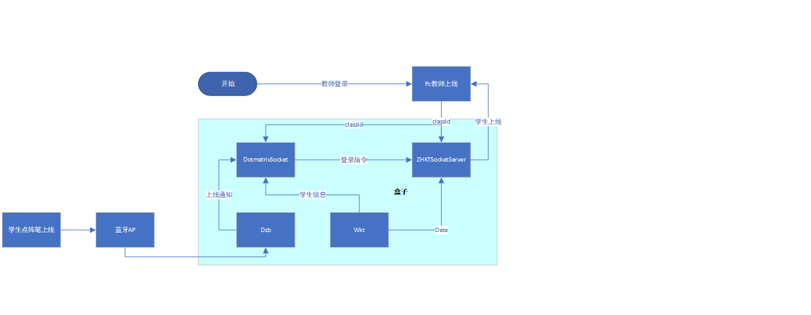
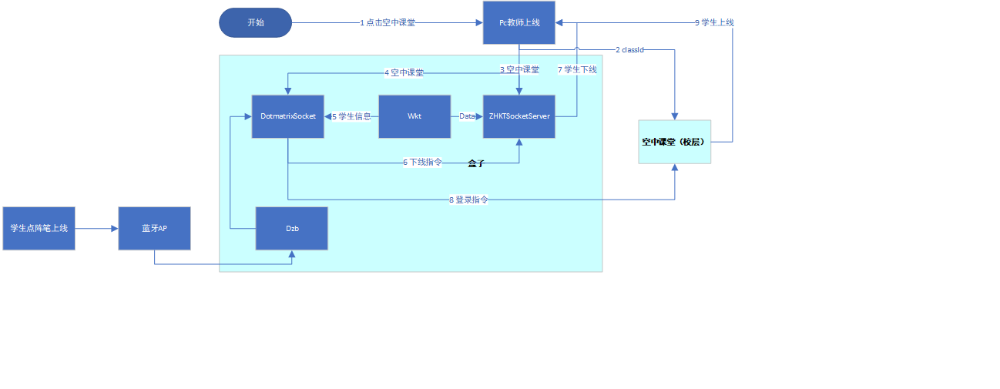
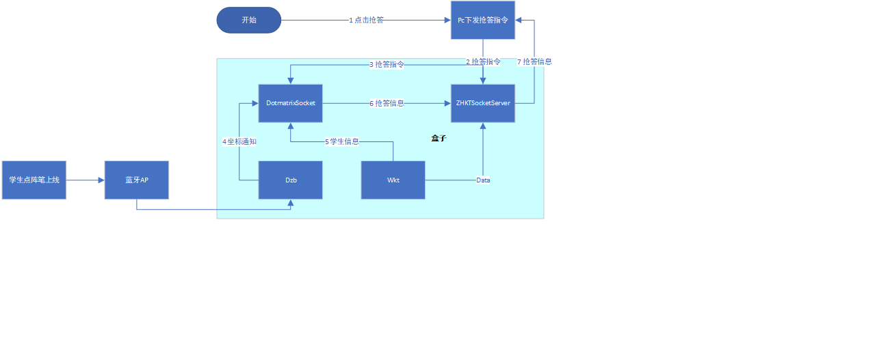
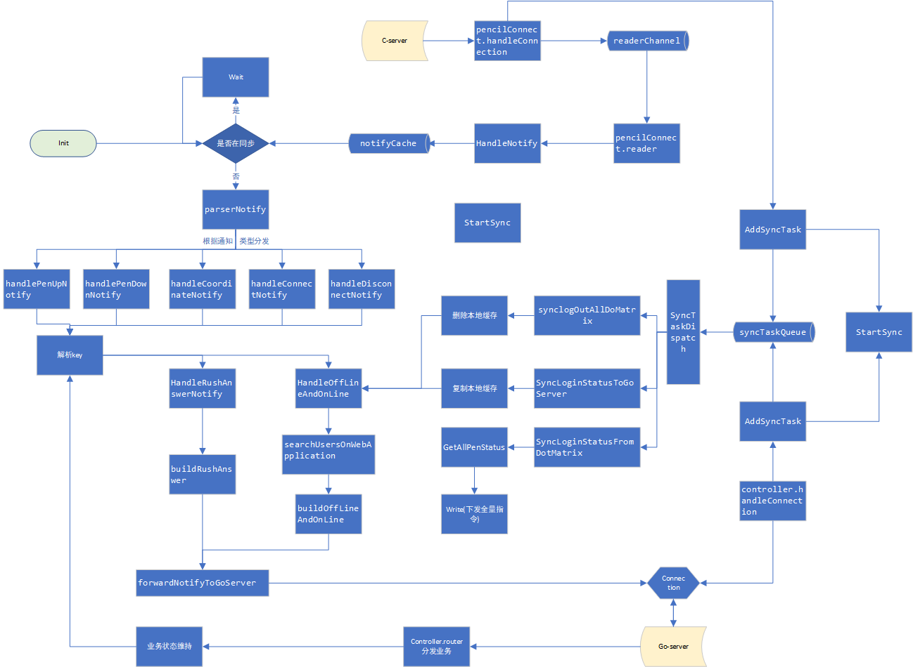

## 点阵笔
Author: helun
Version: 1.0.0
LastModifyTime：2020-02-13 15:04:29 星期四
###整体服系统架构

###点阵笔登录流程
本地课堂登录流程：

	PC教师登录成功后，点阵笔才可登录。


空中课堂登录流程：

	先下线本地课堂，dotmatrixsocketclient，PC链接到空中课堂的盒子，然后登录空中课堂。


抢答流程：

###点阵笔开发说明
项目名称

	纸笔课堂
子项目

	dotmatrixsocketclient(go-client) , zhktsocketserver(go-server)
开发语言

	go(go12.9)

####通知描述
	dzb（C-server）服务到dotmatrixsocketclient的通知定义如下：
[点阵笔通知](http://250.qljy.com:83/web/#/1?page_id=1 "点阵笔通知")

	说明：C-server是dzb项目旧的说法，因为此前dzb是系统中唯一一个c服务，现在已经用go改写。

####指令简述
	go-client，go-server，PAD，PC之间的socket通信指令简要定义如下：
[可能存在变化仅供参考](http://250.qljy.com:83/web/#/6 "可能存在变化进攻参考")

####脚本简介
dotmatrixsocketclient

```
Application.go	程序入口
baseService.go	基本的socket通信实现
InitConfig.go	配置加载
message/ ， model/ , constants/	结构体，静态值
controller.go	路由和处理来自zhktsocketserver的指令
db/	数据库相关
log.go	日志相关
dotmatrix/	点阵笔业务相关（点阵纸参数，点阵笔用户查询...）
pencilClassroom.go	旧的点阵笔交互实现
pencilConnect/	新的点阵笔交互实现（tcp链接，通知，通知处理和转发）
Responder.go	旧实现
toPencilMsgHandler.go	向dzb主动发发送指令
StuDemonstration.go	学生演示
SocketConn.go	保存用户连接
StudentService.go	学生操作(答题，提交，演示...)
web.go	和web端的数据交互
Service.go	异常处理和心跳处理
```
zhktsocketserver

```
Application.go	程序入口
InitConfig.go	配置加载
model/ , constants/	结构体，静态值
SocketServer.go	加载服务启动监听
Service.go	根据收到的指令路由并处理
utils/	工具包（日志，自定义map，类型转化器）
```
####程序流程
	细节实现发生变化，仅做参考

###点阵笔测试说明
####打包
针对不同的运行环境，编译时需要做不同的配置，基本的规则如下:
```
arm:(盒子)
set CGO_ENABLED=0
set GOARCH=arm
set GOOS=linux
set GOBIN=D:\			// 输出包目录
go  build
go install Application.go		// 入口文件

linux:x64(校)
set CGO_ENABLED=0
set GOOS=linux
set GOARCH=amd64
set GOBIN=D:\
go  build
go install Application.go

WINDOWS:
set CGO_ENABLED=0
set GOOS=windows
set GOARCH=amd64
set GOBIN=D:\
go build
go install Application.go
```
dotmatrixsocketclient
	模块化的项目结构，进入..\com\qljy\smart\classroom\last\main\执行上述命令
zhktsocketserver
	进入..\src\执行上述命令
####部署
校层部署

	压缩后，上传至指定分支目录下
	例如：/home/docker-data/分支path/conf/zhktsocketserver_school/
	校层部署需要注意文件的权限。
盒子部署

	将符合盒子运行环境的运行包上传至盒子指定位置
	例如:
	/usr/local/ava_app/school/dotmatrixsocketclient/
	/usr/local/ava_app/school/zhktsocketserver/
####测试准备
	1 本地安装PC客户端，在setting中配置相应学校，校层，盒子层参数（setting.txt位于PC安装目录的根目录）
	2 浏览器输入盒子ip进入盒子管理页面，查询盒子绑定的校层地址（测试中盒子账户:1000,密码:123）
	3 使用管理员账号登录校层（测试中校层账户:1001@schoolKey,密码:0000）
	4 进入校层的‘青鹿后台管理平台’，在里面的班级，教师，学生等栏目添加自己的测试数据。并在点阵笔栏目完成学生和点阵笔的绑定。
	5 PC端使用4中添加的教师账户登录后可以开始点阵笔的相关测试。

